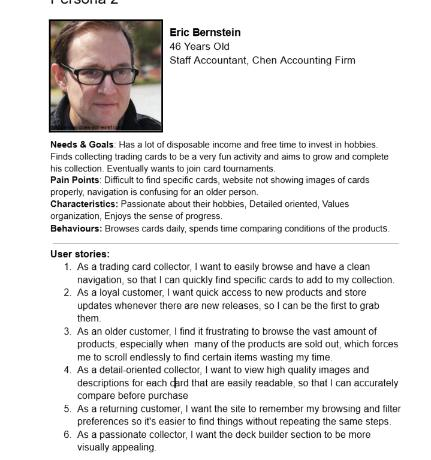

# Week 2 - Scrum

Topics:

    * Scrum Roles
    * Scrum Artifacts (ceremonies)
    * Epics, Scope, and viability
    * Sprint Planning and Estimation Techniques

## I. Scrum, Scrum roles

>Scrum is an Agile framework that structures work into time-boxed sprints, with defined roles, artifacts, and ceremonies for iterative delivery.
>
-Atlassian. _What is Scrum? Breaking down the Agile framework_

**Scrum Roles**

* Product Owner (WHAT) Vision / owns Product Backlog -
Do Right Things
* Development Team (HOW) - owns Sprint Backlog - Do
Things Right
* Scrum Master (Enabling) - Do Things Better

## II. User persona  

User story

A user story is a brief, informal description of a software feature from the perspective of the end-user, explaining who needs it, what they want to do, and why they want to do it

Example:  

